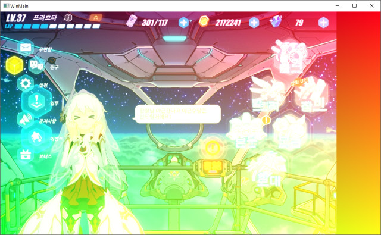

# BruceDrawAMP

Using Direct3D 11 with C++ AMP and no shaders.

## Links:

- https://blogs.msdn.microsoft.com/nativeconcurrency/2012/07/13/image-effects-sample-in-c-amp/
- https://devask.cz/questions/20804388/devicelocated-array-of-pixels-from-c-amp-to-a-window-using-d3d-d2d
- https://github.com/Ninputer/AMP-Demo
- https://stackoverflow.com/questions/23376701/camp-copying-an-image-of-16-bits-from-a-texture-to-texture-from-a-opencv-mat
- https://github.com/MicrosoftDocs/cpp-docs/blob/master/docs/parallel/amp/graphics-cpp-amp.md

## Original:

- https://github.com/carasuca/MinimalDrawAMP

## Screenshot:

